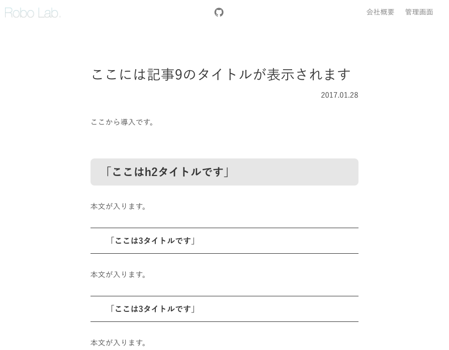

# Rails5 Blog



Rails5のBlogアプリケーションです。  
ポートフィリオ用に作成しました。  
総工数は0.5人日程です。  
記事自体はMarkupで記述します。

## 環境

- Ruby 2.3.0
- Rails 5.0.1
- Bulma 0.3.1

## 導入

```
git clone git@github.com:rl-kawabata/rails5-blog.git
cd ./rails5-blog
bundle install -j4 --path vendor/bundle
sh setup.sh
```

## 起動

```
bundle exec rails s -p 3000
```

## 概要
